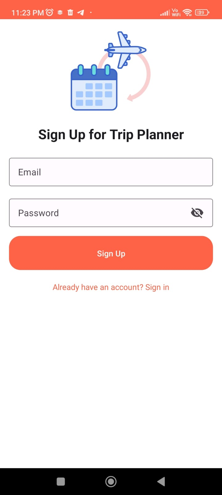

# Trip Planner App

| Image 1 | Image 2 | Image 3 |
| ------- | ------- | ------- |
|  |  |  |
| Image 4 | Image 5 | Image 6 |
| ------- | ------- | ------- |
|  |  | 


This is a new [**React Native**](https://reactnative.dev) project named **Trip Planner**. 

## Project Setup

Before you start, make sure you have completed the [React Native - Environment Setup](https://reactnative.dev/docs/environment-setup) instructions up to the "Creating a new application" step. 

### Step 1: Start the Metro Server

First, you need to start **Metro**, the JavaScript bundler that ships with React Native. Open a terminal in the root of your project and run:

```bash
# Start Metro using npm
npm start

# OR start Metro using Yarn
yarn start


# Start Android using npm
npm run android

# OR start Android using Yarn
yarn android


